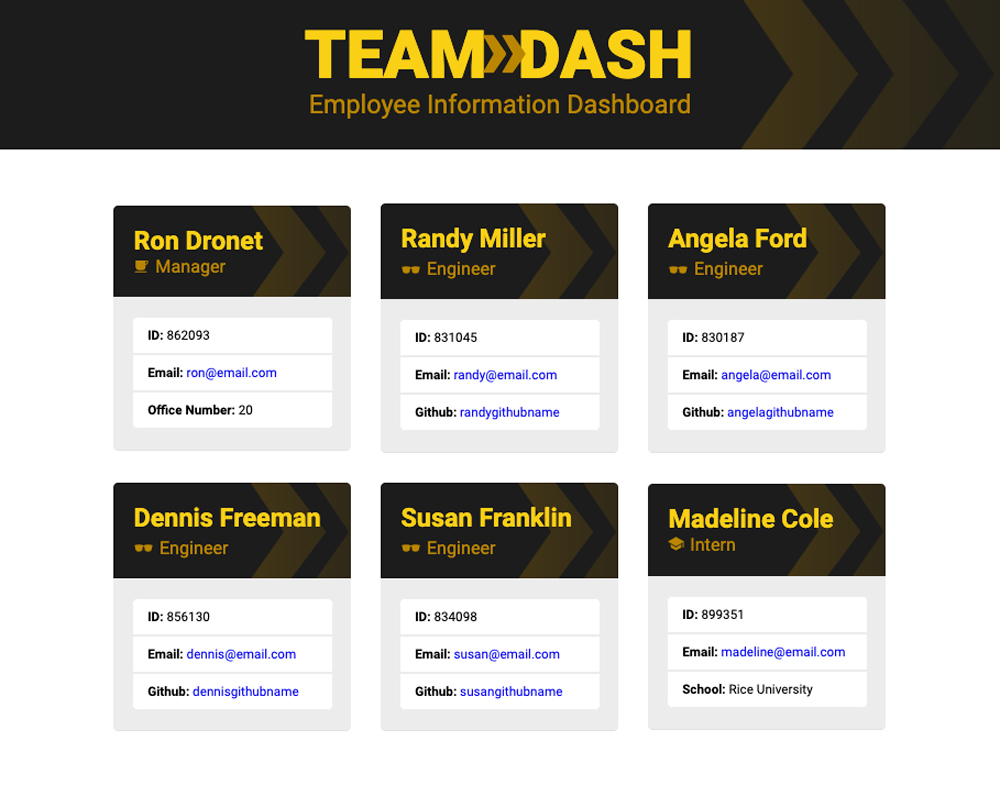

# Team Dash
## An easy to use employee information dashboard!

## Purpose:
The Team Dash app is an HTML file generator that works using the command line. a manager simply inputs employee information when prompted to created a professional looking and easy to read HTML landing page.

## **Table of contents:**
  * [Installation](#installation)
  * [Test](#test)
  * [Usage](#usage)
  * [Contribute](#contribute)
  * [Questions](#questions)

 

     

 

## Viewable Responsive Screen Sizes:
* Desktop: 1800px
* Media Query Sizes:
  - 980px (Desktop - laptops)
  - 768px (Laptop - tablets)
  - 575px (Small devices - large cell phones)

## Video Demo:
https://watch.screencastify.com/v/GHd83auroiZtuTcq1V0J

## This Website Created Using:
* HTML 
* CSS
* JavaScript
* NodeJS 
* Inquirer
* Jest 
* GoogleFonts 
* GitHub
* IonIcons

## Graphic Software Used:
* Adobe Photoshop

## Installation:
  ### *To install use this command in the the terminal:*
  ### npm init

## Test:
  ### *To test use this command in the the terminal:*
  ### node index.js

## Usage:
  ### The respository can be cloned and placed in a folder remotely

## Contribute:
### Please contact me regarding contributing to this repository. All additions must be approved.

## Questions?
### *If you have any questions here's how to contact me:*
* Username: DronetDevDesign
* Repository: https://github.com/DronetDevDesign
* Email: ron@DronetDevDesign.com
