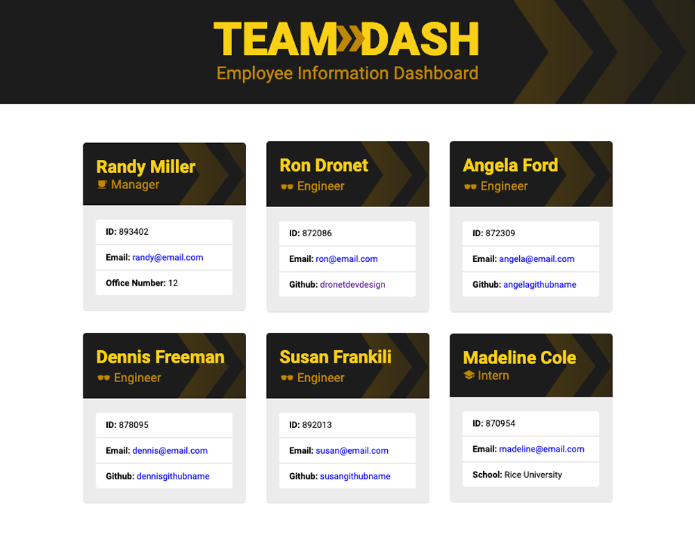

# Team>Dash
## An easy to use employee information dashboard!

## Purpose:
The Team>Dash app is an HTML file generator that works using the command line. a manager simply inputs employee information when prompted to created a professional looking and easy to read HTML landing page.

 

     

 

## Viewable Responsive Screen Sizes:
* Desktop: 1800px
* Media Query Sizes:
  - 980px (Desktop - laptops)
  - 768px (Laptop - tablets)
  - 575px (Small devices - large cell phones)

## Website Link:
https://dronetdevdesign.github.io/Mood-Flix/

## This Website Created Using:
* HTML 
* CSS
* JavaScript
* NodeJS 
* Inquirer
* Jest 
* GoogleFonts 
* GitHub
* IonIcons

## Graphic Software Used:
* Adobe Photoshop

## Contribution:
Ron Dronet
